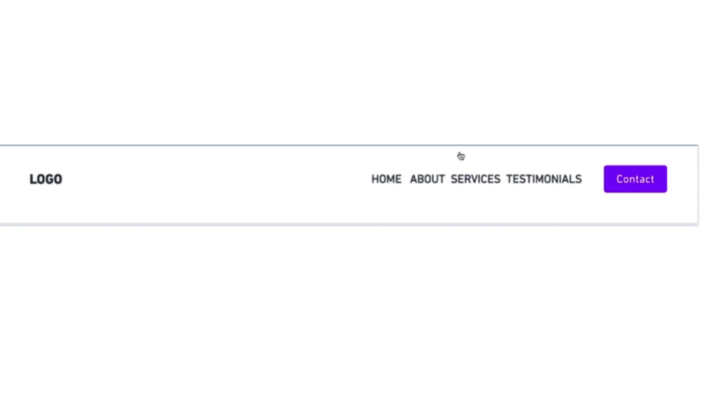
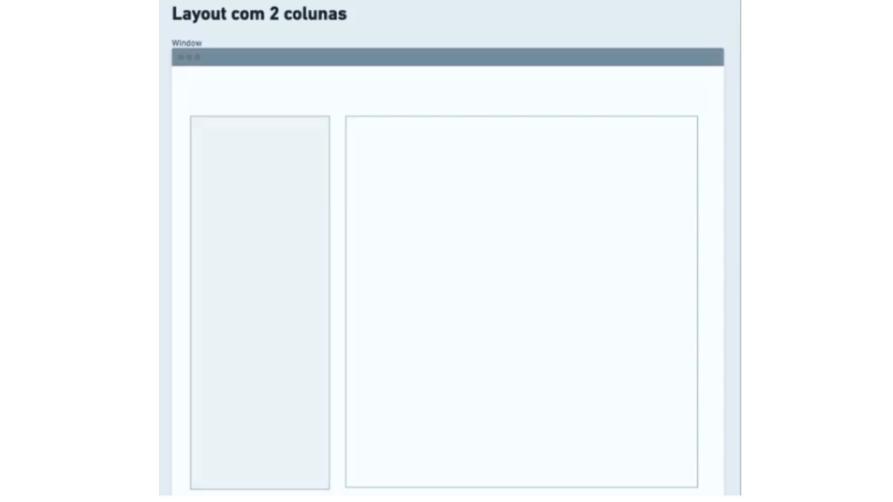
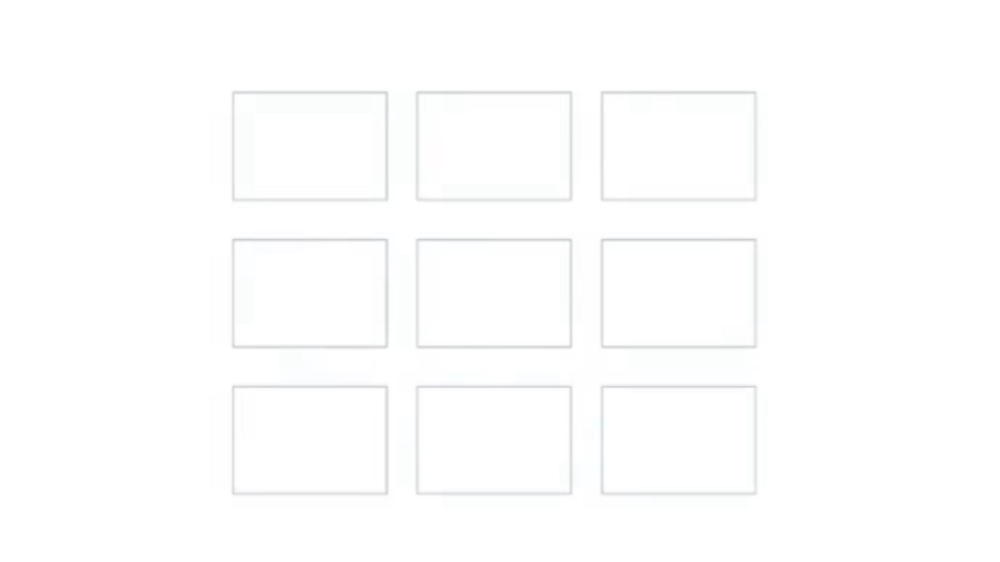

# Layout 
* é a forma como os elementos estão distribuidos na tela 

## Nomal Flow 

* São os elementos **block** e **inline**.
  
    ex: 
    ```html

           <p> Texto Block  <strong> inline</strong> </p>

            <p> texto block </p> 

    ```
     *colocar uma cor de fundo*   
    

* Dá para alterar o Css de Block para inline:
     
     ```css

       p{
             display: inline;
         }
   ```

## Table 

* É a forma de vizualização dos elementos em tabelas.  **tr** == linhas  e **td** == colunas.
    ex.: 
    ```html
        <table>
            <tr>
                <td>Nome:</td>
                <td>Pedro Vinicios</td>
            </tr>

            <tr>
                <td>idade:</td>
                <td>28</td>
            </tr>

        </table>

    ```


# Tabless

* A ideia aqui é não utilizar tabelas na organização dos elementos na tela.
    ex: 

    ```html
         <div id="esquerda">Esquerda</div>
         <div id="direita">Direita</div>
         <div id="normal">Normal</div>

     ```

     * No css:

         ```css
           
           #esquerda{

                float:left;
           }

           #direita{

                float: right;
            }

         ```


    * Se eu quiser que o próximo elemento se comporte normalmente eu coloco:

    ```css
           
            #normal{

                    clear: both;
                }

    ```


     * Centralizando um elemento:

    ```css
           
              #normal{

                    margin: 0 auto;
                    width: 30px;
                }

    ```


## FLEXBOX:

* É um forma de organizar os elementos na tela de forma mais dinâmica. Auxilinando na melhor,   **organização**, **alinhamento** e **distribuição** dos elementos.

 * ex no **HTML**:

 ```html
           
                    <div class="flexbox">
 
                        <div class="item">1</div>
                        <div class="item">2</div>
                        <div class="item">3</div>

                    </div>
```
* no **CSS**:

```css
           
           .flexbox{
                        display: flex;
                        justify-content: space-around;
                    }
```

* Flex container é o elemento *pai* e os itens são os elementos filhos. 
* Outra terminologia utilizada é a de Nesting esse conceito quer dizer que um elemento vive dentro de outro.

* ex. no **HTML**:
```html
    <div class="container">
        <div class="item"></div>
        <div class="item"></div>
        <div class="item"></div>

    </div>
```
### Eixo (axis) principal e cruzado

* É A LINHA PELA QUAL IREMOS ALINHAR NOSSOS ÍTENS


[Referência](https://lucashenriquedeabreu.medium.com/flexbox-layout-a2ab0f0a2f86)

* Ex. no **HTML**:

```html

    <div class="container">
        <div class="item">A</div>
        <div class="item">B</div>
        <div class="item">C</div>

    </div>
```
no **CSS** alterando a posição em relação ao eixo principal:
```css
   .container{
    display: flex;
    justify-content: end;
}

```

* Podemos alterar a disposição dos itens para coluna, com isso alteramos também o eixo principal.

```css
    .container{
        display: flex;
        flex-direction: column;
        height: 500px;
        justify-content: end;

    }
```
### Flex sizing
* Altera o tamanho e a largura de um itens para preenchimento do container. 

 * Ex.:

 ```html 

    <div class="container">
        <div class="item">A</div>
        <div class="item">B</div>
        <div class="item">C</div>
   </div>

```

 ```css 

    .container{
        display:flex;
        border: 1px solid red;
        height: 400px;
    }

    .item{

        border: 1px solid black;
        background-color: gray;

    }

```
* O elemento vai pegar toda a altura no caso 400px; 

* Se utilizarmos a propriedade Flex-sizing podemos alterar o tamanho do elemento:

```css 

    .container{
        display:flex;
        border: 1px solid red;
        height: 400px;
    }

    .item{
        background-color: gray;
        border: 1px solid black;
        flex:1;

    }

```

* Se alterarmos a altura para uma altura mais responsivel, o elemento irá se adaptar ao tamanho da tela:


```css 

    .container{
        display:flex;
        border: 1px solid red;
        height: 80vh;
    }

    .item{
        background-color: gray;
        border: 1px solid black;
        flex:1;

    }

```

### Propriedades do Flex Container

- Flex possui apenas duas direções: **Horizontal** e **vertical**.
- A propriedade para alterar essa direção como vimos é *flex-direction*.
- Ela pode assumir alguns valores: row | row-reverse | column | column-reverse.
- Sendo que por padrão o flex-direction recebe o row;
  - Ex.:
    
     INVERTENDO A LINHA:
```css 

    .container{
        display:flex;
        border: 1px solid red;
        flex-direction: row-reverse;
        height: 80vh;
    }

    .item{
        background-color: gray;
        border: 1px solid black;
        flex:1;

    }

```

COLUNA:

```css 

    .container{
        display:flex;
        border: 1px solid red;
        flex-direction: column;
        height: 80vh;
    }

    .item{
        background-color: gray;
        border: 1px solid black;
        flex:1;

    }

```
INVERTENDO A COLUNA:

```css 

    .container{
        display:flex;
        border: 1px solid red;
       flex-direction: column-reverse;
        height: 80vh;
    }

    .item{
        background-color: gray;
        border: 1px solid black;
        flex:1;

    }

```

### FLEX-WRAP

* Muitas vezes precisamos que os elementos sejam quebrados em várias linhas. 
    -Ex.:

```html 

    <div class="container">
        <div class="item">A</div>
        <div class="item">B</div>
        <div class="item">C</div>
        <div class="item">D</div>
   </div>

```

```css

.container{
    display:flex;
    border: 1px solid red;
    flex-wrap: wrap;
    height: 50vh;
}

.item{

    border: 1px solid black;
    background-color: gray;
    width: 500px;
    

}

```

   
* Também aceita a opção *wrap-reverse*;


* Podemos escrever as propriedades flex-directions e flex-wrap em uma única linha, utilizando o flex-flow:

```css

.container{
    display:flex;
    border: 1px solid red;
    flex-flow: row-reverse wrap;
    height: 50vh;
}

```

## Alinhamento dos itens no eixo principal:

### Justify-content: 

    - Alinhamento dos itens dentro do eixo principal.
    - Distribuição dos elementos

* Valores:
    - Flex-start
    - Flex-end
    - center
    - space around
    - space-between
    - space evenly


```css

.container{
    display:flex;
    border: 1px solid red;
    flex-flow: row wrap;
    justify-content:Flex-start;
    height: 50vh;
}
.item{

    border: 1px solid black;
    background-color: gray;
    width: 250px;
    

}
```

* Lembrando se alterarmos o flex-direction para column o eixo principal muda:

    -Ex.:

```css
.container{
    display:flex;
    border: 1px solid red;
    flex-direction: column;
    justify-content:flex-start;
    height: 100vh;
}

.item{

    border: 1px solid black;
    background-color: gray;
    width: 250px;
    height: 200px;
    

}
```


## Alinhamento dos itens no eixo cruzado

### Align-itens:

    - Alinha os elementos no eixo cruzado:

    - Valores:
        * stretch
        * flex-start
        * flex-end
        * center


```css

.container{
    display:flex;
    border: 1px solid red;
    flex-direction: row;
    justify-content:center;
    align-items:center;
    height: 50vh;
}

.item{

    border: 1px solid black;
    background-color: gray;
    width: 250px;
}

```

* Lembrando se eu alterar o flex-direction para column haverá alteração no comportamento do elemento:


```css 

.container{
    display:flex;
    border: 1px solid red;
    flex-direction: column;
    
    align-items:flex-end;
    height: 50vh;
}

.item{

    border: 1px solid black;
    background-color: gray;
    
}

```

## Espaço entre os elementos

### GAP
- Espaço entre os elementos de um container:

* Valores:
    * Fixas: px, pt;
    * Flexíveis: %, em, rem;


```css 

.container{
    display:flex;
    border: 1px solid red;
    flex-direction: row;
    justify-content: stretch;
    gap: 50px; 
    height: 50vh;
}

.item{

    border: 1px solid black;
    background-color: gray;
    width: 500px;
    
}

```


## Propriedades para os elementos flex (filhos)

### Largura e altura dos itens com flex-basis

```css

    .container{
    display:flex;
    border: 1px solid red;
    flex-direction: row;
    justify-content: stretch;
    gap: 50px; 
    height: 50vh;
}

.item{

    border: 1px solid black;
    background-color: gray;
    flex-basis: 50px;
}

```

* Como a disposição do flex está em linha, o flex-basis vai alterar a largura do ítem, caso seja alterado para column, o flex basis irá alterar a altura do ítem.


## Crescimento e adaptação dos itens 

### flex-grow

- Com essa propriedade, conseguimos adaptar o crescimento do item em relação ao espaços vazios dentro de um container.

- Posso colocar para todos elementos ocuparem os espaços vazios do container:

```css
.container{
    display:flex;
    border: 1px solid red;
    flex-direction: row;
    height: 400px;
   
    
  
}

.item{

    border: 1px solid black;
    background-color: gray;
    width: 100px;
    flex-grow:1;
}

```

- Posso colocar também, por meio da seleção de filhos do css, o flex-grow em apenas um elemento:

```css
.container div:nth-child(1){

    background-color: aqua;
    flex-grow: 1;

}
```

 *isso significa selecionar todos os elementos **div**  que são o primeiro filho de seu elemento pai*


```css 

.container div:nth-child(3),
.container div:nth-child(1)
{

    background-color: aqua;
    flex-grow: 1;

}

```
 *Estou dizendo que os elementos filhos 3 e 1 vão ocupar uma parte cada do espaço vazio*


### flex-shrink 

- Encolhendo o ítem dentro do container.


- Por padrão o flex-shrink é 1, ou seja o elemento vai se adaptar ao tamanho disponível na caixa(container).

-Ex.: 

  ```css 
 
.container{
    display:flex;
    border: 1px solid red;
    width: 400px;
    
  
}

.item{

    border: 1px solid black;
    background-color: gray;
    flex-basis: 100%;
    
}

.container div:nth-child(1),
.container div:nth-child(2),
.container div:nth-child(3)
{

    flex-shrink: 1;

}

```
* Os elementos dentro de container deveriam ter 400px, porém a propriedade padrão flex-shrink não os deixa ultrapassar o tamanho da caixa.

* Se alterarmos esse valor para 0, todos os itens terão 400px e com isso quebrará a visualização dos elementos.

* Quando coloco um valor maior que um, o elemento que tiver esse valor, vai perder espaço em relação aos outros.


# Desafio 1 




# Desafio 2



# Desafio 3 



